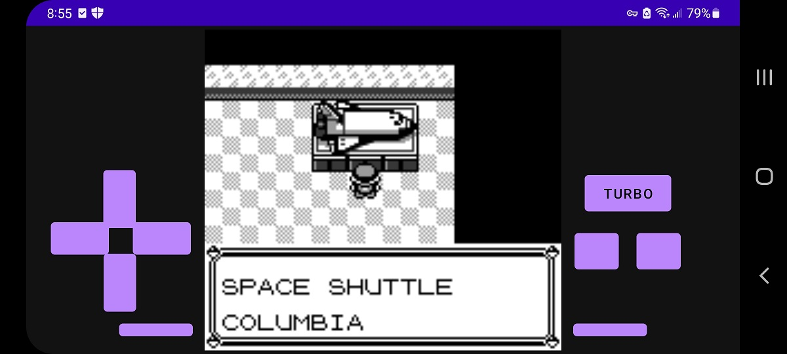
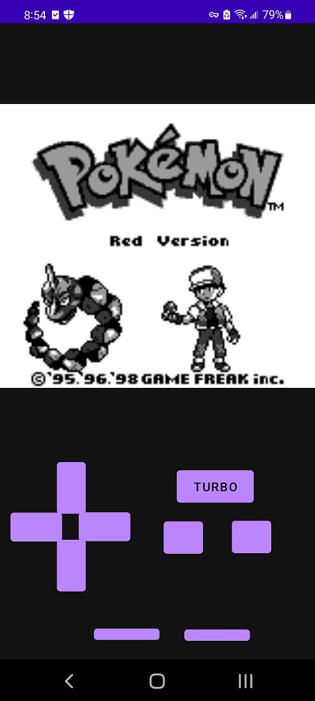

# GBAndroid
`GBAndroid` is a Nintendo GameBoy emulator app for Android. It implements an app layer on top of [GBLib](https://github.com/David-Parker/GBLib).

## How to Build
Clone the repository and initialize submodule dependencies.
`git clone --recurse-submodules https://github.com/David-Parker/GBAndroid.git`

Open project folder with Android Studio and make the project.

## License
`GBAndroid` is released under the MIT license.

## Running
Place your roms in the `rom` folder in `app/src/main/assets/rom`. This rom folder is deployed onto the android device at startup.

## Media

